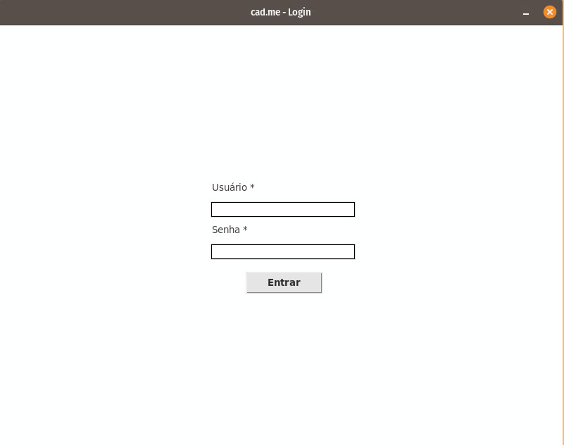
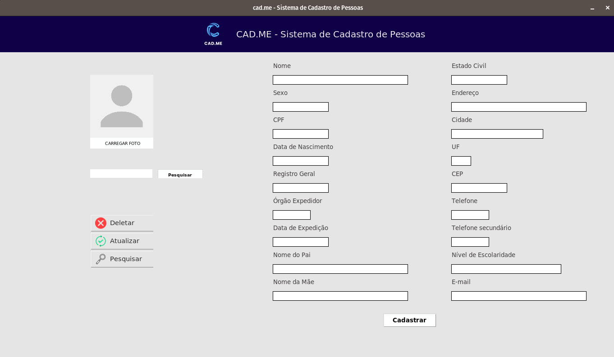

# cad.me

cad.me is an open-source Python-based user registration system.  
It allows storing personal information such as name, CPF, birthday and other custom fields.

This project was created to practice authentication logic, data persistence and command-line application development.

## Features

• User registration  
• Login system  
• Data storage and retrieval  
• Simple command-line interface  

## Technologies Used

Python and SQLite.

## How to Run

Make sure Python 3 is installed.

Run the program with:

## Default Login

| User   | Pass   |
| ------ |:------:|
| admin  | admin  | 

## Screenshots

