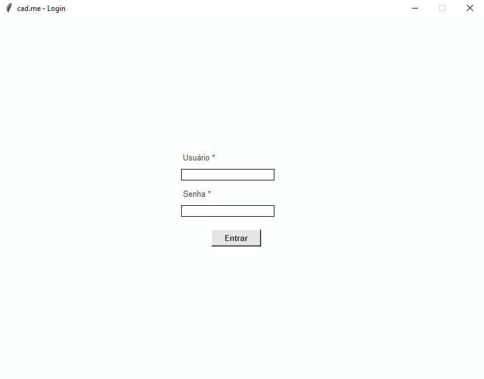
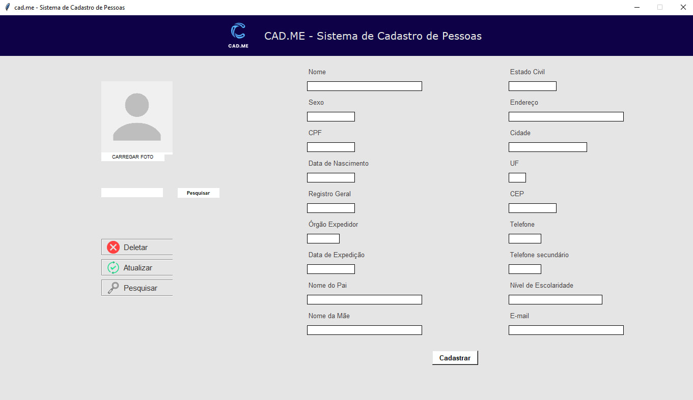

# cad.me

cad.me is an open-source Python-based user registration system.  
It allows storing personal information such as name, CPF, birthday and other custom fields.

## Features

• User registration  
• Login system  
• Data storage and retrieval  
• Simple command-line interface  

## Technologies Used

Python and SQLite.

## How to Run

Make sure Python 3 is installed.

1) Run `python3 db.py` to create the database.
2) Run the program with: `python3 cadme.py`.

## Default Login

| User   | Pass   |
| ------ |:------:|
| admin  | admin  | 

**Note**: if you don't wanna use the above credentials, you can delete the `usuarios.db` file and insert a new one on the database.

## Screenshots

